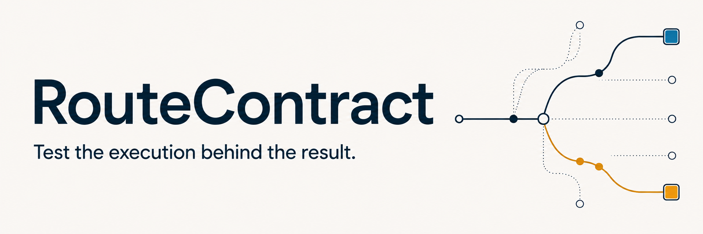
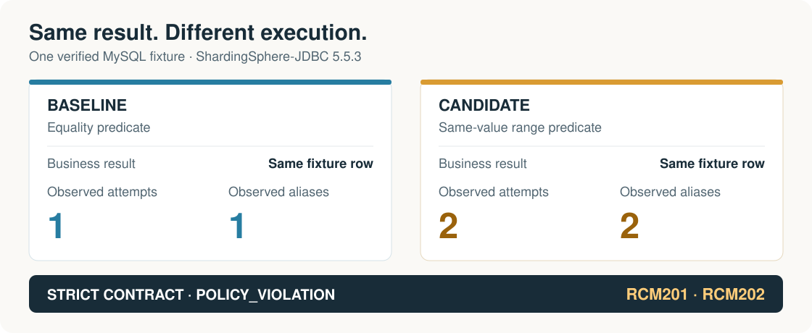

<h1 align="center">
  
</h1>

<p align="center">
  <a href="https://github.com/ym0506/routecontract/actions/workflows/ci.yml?query=branch%3Amain"></a>
  <a href="https://central.sonatype.com/artifact/io.github.ym0506.routecontract/routecontract-shardingsphere-5.5/0.1.3"></a>
  <a href="LICENSE"></a>
</p>

<p align="center">
  <a href="#install-013">설치</a> · <a href="#사용-예">사용 예</a> · <a href="#동작-확인">시연</a> · <a href="#문서">문서</a> · <a href="README.md">English</a>
</p>

**조회 결과는 같은데, DB 실행은 달라질 수 있습니다.**

RouteContract는 [Apache ShardingSphere-JDBC](https://github.com/apache/shardingsphere)의
`SQLExecutionHook`이 보고한 물리 JDBC 실행 시도를 기록하고, 명시한 예산과 사람이 검토한
기준에 맞는지 확인하는 Java 테스트 라이브러리입니다. 기존 업무 결과 assertion에 실행 시도 수,
관측 데이터 소스, 재작성된 SQL 구조의 변화 검사도 더할 수 있습니다.

포함된 MySQL 예제는 **같은 행을 반환하면서 관측된 실행 시도가 1회에서 2회로 증가**합니다.
RouteContract는 이 변화를 CI에서 잡아냅니다.

## Install 0.1.3

기존 **Java 17 · ShardingSphere-JDBC 5.5.3** 테스트 프로젝트에 추가하세요.
지원하는 작업은 **동기식·비배치 `PreparedStatement` 호출**입니다.

**Gradle** — Groovy / Kotlin DSL 공통:

```kotlin
repositories { mavenCentral() }

dependencies {
    testImplementation("io.github.ym0506.routecontract:routecontract-shardingsphere-5.5:0.1.3")
}
```

<details>
<summary><strong>Maven</strong> — pom.xml의 dependencies에 추가</summary>

```xml
<dependency>
  <groupId>io.github.ym0506.routecontract</groupId>
  <artifactId>routecontract-shardingsphere-5.5</artifactId>
  <version>0.1.3</version>
  <scope>test</scope>
</dependency>
```

</details>

기존 ShardingSphere·데이터 소스 설정을 유지하세요. 테스트 runtime의 ShardingSphere 모듈은
모두 **정확히 5.5.3**이어야 합니다. RouteContract가 ShardingSphere를 설치하거나 전체 의존성
버전을 맞춰주지는 않습니다. 이 의존성 설치에는 저장소 clone이나 로컬 설치기가 필요 없습니다.

<a id="가장-작은-사용-예"></a>

## 사용 예

기존 통합 테스트에서 작업 하나를 감쌉니다.

```java
import io.github.ym0506.routecontract.RouteAssertions;
import io.github.ym0506.routecontract.RouteContract;
import io.github.ym0506.routecontract.RouteSnapshot;

import static org.junit.jupiter.api.Assertions.assertEquals;

RouteSnapshot snapshot = RouteContract.capture("orders.find-by-user-id", () -> {
    Order actual = orderRepository.findByUserId(3L);
    assertEquals(201L, actual.id()); // 기존 업무 결과 assertion을 유지합니다.
});

RouteAssertions.assertThat(snapshot)
        .hasCompleteCapture()
        .hasNoReportedExecutionFailures()
        .hasExactlyObservedPhysicalAttempts(1)
        .observesExactlyDataSourceNames("ds_1");
```

`Order`와 `orderRepository`는 기존 테스트 fixture를 뜻합니다. 지원하는 JDBC 실행 범위에서
작동하는 작업을 선택하고, 예상 결과·데이터 소스 이름·실행 예산을 자신의 fixture에 맞게
정하세요. hook callback의 반환은 트랜잭션 커밋을 증명하지 않습니다.

### 기준을 검토한 뒤 CI에서 비교하기

1. 대표 작업을 capture하고 **candidate manifest**를 생성합니다.
2. 관측 내용, 민감하지 않은 데이터 소스 별칭, 실행 예산을 버전 관리에서 검토합니다.
3. baseline을 명시적으로 승인한 뒤 이후 candidate를 CI에서 비교합니다.

candidate 생성만으로 baseline이 승인되지는 않습니다. 의도한 변경도 새 검토를 거칩니다.
[첫 프로젝트 가이드](docs/first-project.ko.md)에서 Maven·Gradle 예제로 Central 설치부터
기준 검토와 CI 실패 확인까지 따라갈 수 있습니다.
[Manifest API 예제](docs/reference-guide.md#approved-manifests-and-structural-manifest-diffs)와
[CI 리포트 가이드](docs/ci-review-report.md)에서 Java API, Markdown·JSON 출력,
진단 코드와 조사 방법을 확인할 수 있습니다.

## 동작 확인

[2분 54초 시연 영상 보기](https://www.youtube.com/watch?v=pcgvNNxd1mM) ·
[실제 CI 리포트 보기](docs/evidence/ci-review-report-example.md)



그림은 [체크인된 MySQL manifest](examples/manifests/README.md)를 요약한 것입니다.
수치는 **hook이 보고한 물리 JDBC 실행 시도와 관측 별칭**입니다.
물리 테이블 수, 전체 라우팅 계획이나 성능을 측정한 값은 아닙니다.

<a id="quick-start"></a>

### 예제 실행

| 해볼 일 | 필요한 환경 | 예상 결과 |
| --- | --- | --- |
| [v0.1.3 CI 리포트 생성](docs/ci-review-report.md#try-the-released-report-without-docker) | Git, Java 17, 최초 의존성 다운로드 | 저장된 manifest를 비교해 `POLICY_VIOLATION`, `RCM201`·`RCM202`를 출력합니다. 의도적으로 검사가 실패하는 예제이며 Docker는 필요 없습니다. |
| [MySQL 실행 변화 재현](docs/reference-guide.ko.md#quick-start) | Git, Java 17, Docker, 최초 다운로드 | 불변 tag에 고정한 과거 **v0.1.2** 시연입니다. wrapper는 예상한 계약 거부까지 확인하면 성공합니다. |
| [v0.1.3 첫 프로젝트 예제](docs/first-project.ko.md) | Git, Java 17, Docker; Maven 또는 Gradle wrapper | candidate 생성·기준 검토·`MATCH`를 확인하고, 같은 결과에서 실행 시도 `1 → 2` 변화로 실패하는 과정을 실행합니다. |

## 지원 범위

| 구분 | 공개 v0.1.3 |
| --- | --- |
| Java | 17 |
| ShardingSphere | JDBC, **정확히 5.5.3** |
| 실행 | 정상 반환하며 caller interruption이 없는 동기식·비배치 `PreparedStatement` 작업 |
| DB 검증 환경 | MySQL 8.4.11 · [공개 Gradle·Maven 소비자 검증](docs/evidence/release-0.1.3-central.md) |
| 검사 | capture 완전성, callback 결과, 실행 시도·데이터 소스 예산, manifest 구조 차이 |
| CI 출력 | Java assertion, 결정적인 Markdown·JSON 리포트, `ManifestReviewCli` |

Proxy, batch, reactive 실행, 애플리케이션이 만든 async 경계와 SQL Federation 경로 전반은
지원 범위 밖입니다. 관측 SQL이 없는 작업, callback 실패나 caller interruption이 있는 작업은
통과한 계약을 만들 수 없습니다. [전체 capture 경계](docs/reference-guide.md#v01-support-boundary)를 확인하세요.

**프로젝트 상태:** v0.1.3은 Maven Central에 공개되어 있습니다.
[0.2 core·adapter 분리](https://github.com/ym0506/routecontract/pull/62)는 개발 중이며 5.5.2 지원은
미출시입니다. 공개 소비자 검증은 유지관리자가 실행한 결과이고, 독립적인 외부 통합·반복 사용은
아직 확인되지 않았습니다.

## 문서

| 주제 | 안내 |
| --- | --- |
| 내 상황에 맞는 시작점 | [Start here](docs/start-here.md) |
| 공개 라이브러리를 프로젝트에 적용 | [첫 프로젝트](docs/first-project.ko.md) · [English](docs/first-project.md) |
| API·정책·상세 재현 절차 | [한국어 상세 가이드](docs/reference-guide.ko.md) · [English guide](docs/reference-guide.md) |
| CI 실패 검토 | [리포트·CLI](docs/ci-review-report.md) · [리포트 예제](docs/evidence/ci-review-report-example.md) |
| 관측 내용 이해 | [아키텍처](docs/architecture.md) · [명세](docs/specification.md) |
| 기존 도구와 비교 | [도구 비교](docs/competitive-analysis.md) · [datasource-proxy 실험](docs/empirical-comparison.md) |
| 애플리케이션 적용 실험 | [CityPulse: 공개 0.1.3으로 테스트 한 개 실행](docs/evidence/citypulse-isolated-pilot-2026-09-08.md) · 자체 실험이며 유지보수자 채택 사례는 아닙니다 |
| 릴리스 검증 | [v0.1.3 Central 검증](docs/evidence/release-0.1.3-central.md) · [증거 목록](docs/evidence-matrix.md) |
| 이전 통합 도구 | [v0.1.2 통합 가이드](docs/first-integration.md) — 과거 버전에 고정한 절차 |
| 기여 | [기여 가이드](CONTRIBUTING.md) · [로드맵](docs/product-roadmap.md) |

### 데이터 처리

snapshot과 manifest에는 원문 SQL, 바인딩 값, 접속 설정, 예외 메시지를 저장하지 않습니다.
다만 operation ID, 타입·데이터 소스 이름, SQL fingerprint도 민감한 개발 정보가 될 수 있으며,
fingerprint는 익명화가 아닙니다. 민감하지 않은 별칭과 합성 테스트 값을 사용하고,
공유 전에는 [SECURITY.md](SECURITY.md)를 확인하세요.

## 다음 버전을 함께 만들어요

ShardingSphere-JDBC를 사용한다면 [사용 버전과 SQL·설정 변경을 검증하는 방법](https://github.com/ym0506/routecontract/issues/new?template=stable-feedback.yml)을 알려주세요.
놓치고 있는 검사나 설치 중 막힌 지점을 짧게 적어주셔도 도움이 됩니다. 처음부터 설치하거나
공개 저장소를 준비할 필요는 없습니다. 공개 이슈에는 비공개 SQL·바인딩 값·접속 정보·전체 로그를 넣지 마세요.

재현 가능한 버그는 최소 합성 fixture와 함께 [이슈 양식](https://github.com/ym0506/routecontract/issues/new/choose)으로
남겨주세요. [사용 경험과 피드백 기록 기준](docs/user-feedback.md)도 확인할 수 있습니다.

## 라이선스

[Apache License 2.0](LICENSE). [서드파티 고지](THIRD_PARTY.md) ·
[선행 작업 공개](ORIGIN_AND_PRIOR_WORK.md) · [AI 사용 공개](AI_ASSISTANCE.md).

RouteContract는 Apache Software Foundation의 공식 프로젝트가 아니며 제휴·보증 관계가 없습니다.
Apache와 Apache ShardingSphere는 Apache Software Foundation의 상표입니다.
