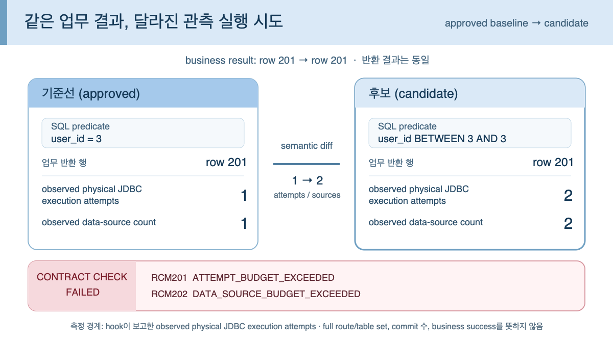

# RouteContract for ShardingSphere-JDBC

[한국어](README.md) | [English](README.en.md)

[](https://github.com/ym0506/routecontract/actions/workflows/ci.yml?query=branch%3Amain)

> **Maintainers: start with a 30-minute fit check — no setup required.**
> [English pilot details](README.en.md) · [Reply `interested` in Discussion #34](https://github.com/ym0506/routecontract/discussions/34)
>
> **30분 fit check로 assisted pilot 시작 — 신청 전 설치 불필요**
>
> 공개 Java 17 저장소에서 정확히 ShardingSphere-JDBC 5.5.3과 기존 동기식 non-batch
> `PreparedStatement` 테스트 하나를 유지한다면 [Discussion #34에 `interested` 3줄 답글을
> 남기세요](https://github.com/ym0506/routecontract/discussions/34). 먼저 공개 코드만 보고
> fit/not-fit을 답하고, 맞으면 대표 operation 하나의 private first-pass patch를 준비합니다.
> 별도 확인 전에는 공개 PR을 열거나 baseline을 승인하지 않으며, 이를 채택으로 표현하지
> 않습니다.

[Apache ShardingSphere-JDBC](https://github.com/apache/shardingsphere)는 Java 애플리케이션 안에서 하나의 논리 SQL을 여러 data source로 나눠 실행할 수 있는 JDBC middleware입니다. RouteContract는 기능 결과만 보는 테스트가 놓칠 수 있는 실행 구조 변화를 사람이 검토한 승인본과 비교해 manifest assertion을 실패시키는 Java 테스트 라이브러리입니다. 이 assertion을 required CI check로 설정하면 승인되지 않은 변화가 merge되는 것을 막을 수 있습니다.

- **사용자:** Apache ShardingSphere-JDBC 5.5.3을 사용하거나 도입을 평가하는 Java 개발자·팀
- **검출 공백:** 기능 assertion이 같은 한 행으로 통과해도 hook이 보고한 물리 JDBC 실행 시도와 data source는 각각 `1 → 2`로 달라질 수 있음
- **CI 판단:** 검증한 `1 → 2` fixture에서는 시도 수·data-source 예산 초과가 `RCM201`·`RCM202` manifest assertion 실패가 됨; 이를 required check로 설정하면 merge를 막을 수 있지만, `1 → 2` 자체를 성능 결함으로 단정하지 않고 의도한 변경인지 사람의 검토를 요구함
- **검증 경계:** Java 17, 정확히 ShardingSphere-JDBC 5.5.3, 정상 반환·비-interrupt 동기식 non-batch `PreparedStatement`; SQL 의미 동치나 complete route plan·commit·비즈니스 성공은 판정하지 않음

[2분 54초 시연 영상 보기](https://www.youtube.com/watch?v=pcgvNNxd1mM)



## Quick Start

필수 조건은 Git, Java 17, 실행 중인 Docker daemon, Bash/POSIX 도구와 실행 가능한 Gradle
Wrapper입니다. 최초 실행은 공개 tag, Gradle·Maven Central 의존성과 로컬에 없는
digest-pinned MySQL container image를 내려받기 위한 네트워크가 필요할 수 있습니다.

```bash
(
set -euo pipefail
source_dir="routecontract-v0.1.0"
test ! -e "${source_dir}"
test ! -L "${source_dir}"
git clone --quiet --depth 1 --branch v0.1.0 --single-branch \
  https://github.com/ym0506/routecontract.git "${source_dir}"
test "$(git -C "${source_dir}" cat-file -t refs/tags/v0.1.0)" = tag
test "$(git -C "${source_dir}" rev-parse refs/tags/v0.1.0)" = e3944631ad827e88d4936b75e9b738ef50a22b20
test "$(git -C "${source_dir}" rev-parse 'refs/tags/v0.1.0^{}')" = db203cfd9202ff10cd22c41cf04034eca5177341
test "$(git -C "${source_dir}" rev-parse HEAD)" = db203cfd9202ff10cd22c41cf04034eca5177341
test -z "$(git -C "${source_dir}" status --short)"
cd "${source_dir}"
./scripts/quickstart-demo.sh
)
```

이 명령은 실제 MySQL에서 business result가 그대로인 `1 → 2` 관측 실행 회귀를 검증한 뒤,
같은 candidate를 CI gate에 넣어 `RCM201`·`RCM202` 거부를 확인합니다. 마지막에
`[ROUTECONTRACT QUICKSTART VERIFIED]`, `realMysqlDemoExit 0`,
`intentionalCiGateExit 1`, `quickstartExit 0`이 출력되면 예상한 전체 흐름이 통과한 것입니다.

<details>
<summary>정확한 종료 코드와 출력 경계</summary>

내부 CI gate의 종료 코드 `1`은 의도한 계약 거부이고, quickstart 자체의 `0`은 그 거부까지
정확히 검증했다는 뜻입니다. preflight나 검증이 실패하면 quickstart는 `2`로 종료하며, 원문
SQL·parameter·connection 정보가 섞일 수 있는 하위 프로세스 원문은 화면에 다시 출력하지 않습니다.

</details>

## 다음 단계: 첫 통합 가능성 검토하기

Quick Start가 통과했다면 [첫 실제 통합 가이드](docs/first-integration.md)의 지원 경계와 중단
조건을 확인하고, 기존 ShardingSphere-JDBC 5.5.3 통합 테스트에서 business assertion을 유지할
대표 operation 하나를 고르세요. 가이드는 격리된 Gradle Groovy 또는 Maven 3.9.14 pilot에서
capture → candidate → 사람 승인 baseline → candidate check를 연결합니다. 저장소별 빌드 격리와
사람 검토가 필요하므로 완료 시간을 약속하지 않습니다.
`v0.1.0`은 Maven Central에 게시되어 있지 않으므로 가이드는 검증된 GitHub Release 자산을
별도 로컬 Maven repository에 설치하는 현재 경로를 사용합니다.

1,700여 줄 가이드를 처음부터 끝까지 읽지 말고, 다음 순서로 필요한 부분만 사용하세요.

1. [고정된 Release 자산을 설치](docs/first-integration.md#2-install-the-exact-v010-release-assets)합니다.
2. 빌드에 맞춰 [Gradle Groovy lane](docs/first-integration.md#gradle-groovy-dsl-opt-in-lane) 또는
   [Maven 3.9.14 lane](docs/first-integration.md#maven-3914-opt-in-profile-lane) 하나만 선택합니다.
3. 공통 단계인 [대표 operation](docs/first-integration.md#3-add-one-representative-operation) →
   [사람의 baseline 승인](docs/first-integration.md#4-review-and-approve-the-first-baseline) →
   [CI candidate check](docs/first-integration.md#5-run-the-candidate-check-in-ci)로 이동합니다.

Maven 사용자는 체크인된 [두 모듈 reference fixture](examples/maven-pilot/README.md)를 먼저
실행해 자신의 저장소와 다른 지점을 확인할 수 있습니다. 어느 lane에도 정확히 맞지 않으면
일반 예시를 억지로 붙이지 말고 그 지점에서 중단하세요.

처음 실행했거나 현재 환경에는 맞지 않는다고 판단했다면
[stable v0.1.0 feedback form](https://github.com/ym0506/routecontract/issues/new?template=stable-feedback.yml)에
성공·막힌 지점·지원 범위 밖·필요 없음 중 어느 결과든 짧게 남길 수 있습니다. 공개 Issue에는
원문 SQL, bind 값, JDBC URL, 실제 topology, full log 같은 민감 정보를 넣지 마세요.

## 가장 작은 사용 예

```java
RouteSnapshot snapshot = RouteContract.capture("orders.find-by-user-id", () -> {
    Order actual = orderQueryService.findByUserId(3L);
    assertEquals(201L, actual.id()); // 기존 기능 assertion도 그대로 둡니다.
});

RouteAssertions.assertThat(snapshot)
        .hasCompleteCapture()
        .hasNoReportedExecutionFailures()
        .hasExactlyObservedPhysicalAttempts(1)
        .observesExactlyDataSourceNames("ds_1");
```

## 승인 manifest와 structural manifest diff

하나의 application operation 동안 `SQLExecutionHook`으로 **보고된 물리 JDBC 실행 시도**를 결정적인 manifest로 만들고, operation별 실행 예산과 구조 필드를 회귀 계약으로 검증합니다. **structural manifest diff**는 시도 수·alias·callback outcome·exact rewritten-SQL fingerprint·parameter 구조 비교이며 SQL 의미 동치나 complete route plan을 판정하지 않습니다.

```java
DataSourceAliases aliases = DataSourceAliases.of(Map.of(
        "ds_0", "orders-a",
        "ds_1", "orders-b"));
ManifestPolicy policy = ManifestPolicy.strict(1, 1);

ObservedExecutionManifest candidate = ObservedExecutionManifest.from(
        snapshot, aliases, policy);

Path approvedPath = Path.of("route-contracts/orders.find-by-user-id.json");
Path candidatePath = Path.of("build/routecontract/orders.find-by-user-id.candidate.json");
new ManifestStore().writeCandidate(approvedPath, candidatePath, candidate);

ObservedExecutionManifest approved = new ManifestStore().read(approvedPath);
ManifestVerificationResult result = new ManifestVerifier().verify(approved, candidate);
ManifestAssertions.assertMatched(result); // mismatch이면 stable RCM code와 함께 CI 실패
```

candidate 기록은 approved 파일을 자동으로 덮어쓰지 않습니다. 변경이 의도된 경우 사람이 diff를 검토한 뒤 명시적으로 승인본을 교체해야 합니다.

실제 MySQL equality 기준과 같은 결과를 반환하는 `BETWEEN` candidate의 canonical JSON 및
검증기 출력은 [examples/manifests](examples/manifests/README.md)에 있습니다. 통합 테스트가
매번 이 파일들을 다시 생성해 byte-for-byte 일치와 stable RCM code를 동반한 결정적
structural manifest diff를 확인합니다.

<details>
<summary>alias 신뢰 경계와 strict/budgetOnly 정책 상세</summary>

data-source alias mapping 역시 승인 계약의 일부인 신뢰 설정입니다. manifest에는 호출자가 제공한 alias가 저장되므로, alias에는 비민감한 고정 이름만 사용해야 합니다. 실제 data-source 이름을 alias로 그대로 재사용하면 그 이름이 노출되고, 다른 실제 data source를 기존 alias로 조용히 재매핑하면 drift를 숨길 수 있습니다. mapping은 manifest와 함께 version control에서 검토해야 합니다.

- `ManifestPolicy.strict(...)`: fingerprint를 포함한 구조 signature 변화도 차단합니다.
- `ManifestPolicy.budgetOnly(...)`: 시도 수·data-source 집합·callback outcome 변화는 차단하고, signature-only 변화는 `REVIEW_REQUIRED`로 남깁니다.
- canonical JSON에는 timestamp, UUID, thread 배치, 원문 SQL, parameter 값, exception message가 들어가지 않습니다. data source는 호출자가 제공한 alias로만 기록되며, 그 alias의 비민감성은 호출자의 책임입니다.

같은 행, 관측 시도 `1`, 같은 data source를 보존하면서 추가 filter와 predicate 순서를 바꾼
MySQL fixture에서는 fingerprint와 parameter type 순서만 달라졌습니다. 이는 그 fixture의
관측 결과일 뿐 두 SQL의 일반적인 의미 동치를 주장하지 않습니다.

| 정책 | 이 signature-only 변화의 결과 | 선택 시 tradeoff |
|---|---|---|
| `strict` | `DRIFT`, `RCM301`·`RCM302` blocking, assertion 실패 | 작은 rewritten-SQL 구조 변화도 검토·승인하게 하지만, 의도적 변화도 baseline 갱신 전까지 CI를 막음 |
| `budgetOnly` | `REVIEW_REQUIRED`, `RCM301`·`RCM302` non-blocking, `passesBlockingChecks=true` | 예산·data-source 집합·callback outcome은 계속 막지만 signature-only 변화는 CI를 통과시키므로 수동 검토를 놓치면 구조 회귀를 허용할 수 있음 |

위 예시의 `ManifestAssertions.assertMatched(result)`는 `REVIEW_REQUIRED`도 거부합니다. signature-only
변화를 의도적으로 CI에서 허용하는 `budgetOnly` 정책이라면 그 선택을 코드에 드러내기 위해
`ManifestAssertions.assertPassesBlockingChecks(result)`를 사용해야 합니다.

</details>

## 검증된 핵심 시나리오

| 시나리오 | 실제 검증 결과 |
|---|---|
| 동일 값 `=` → `BETWEEN` | 비즈니스 행은 같고, 관측 시도 `1 → 2`, data source `[ds_1] → [ds_0, ds_1]` |
| 공개 이슈 #38456에서 영감을 받아 축소·수정한 fixture | JOIN과 subquery의 결과는 모두 `COUNT=1`, 관측 시도는 각각 `1`과 `8`; 원 이슈의 충실한 재현 주장은 아님 |
| 설정 회귀 | table strategy 제거 시 실행 수와 data source는 같지만 SQL fingerprint drift 검출 |
| 결정성 | corpus 8개를 각 20회 실행한 160 captures에서 case별 구조 signature 1개 |
| 동시에 열린 caller-operation scope | single-attempt/multi-attempt scope 20쌍에서 교차 귀속 0건; 물리 callback의 시간상 중첩은 강제하거나 측정하지 않음 |
| 범용 JDBC 도구 비교 | datasource-proxy 외부 배치는 callback `1 → 1`, 물리 DS별 배치는 `1 → 2`, RouteContract도 `1 → 2` |
| 격리된 소비자 빌드 | 같은 checkout에서 임시 Maven 저장소에 생성한 JAR와 POM만 사용하는 standalone consumer에서 SPI 자동 발견과 MySQL 실행 통과. 외부 채택 증거는 아님 |
| 격리된 Maven 3.9.14 pilot | inactive profile, fresh cache, SHA-256 음성 검증, MySQL candidate와 mechanical match를 같은 checkout에서 검증. 사람 승인·외부 사용자·adoption 증거는 아님 |

전체 52-test 검증:

```bash
./gradlew --no-daemon --no-build-cache clean check assemble validateOfficialCycloneDxSbom
./scripts/verify-standalone-consumer.sh
./scripts/verify-maven-pilot.sh
```

첫 명령은 Java 17, ShardingSphere-JDBC 5.5.3, digest로 고정한 MySQL 8.4.11 Testcontainers 환경에서 core 및 MySQL corpus 52개 테스트를 실행하고 JAR·Javadoc·SBOM을 생성합니다. 두 번째 명령은 별도 소비자 테스트 1개를 실행합니다. 세 번째 명령은 exact Apache Maven 3.9.14가 필요하며 격리된 profile-off/checksum/candidate 경로를 검증합니다. 모두 Docker가 필요합니다.

## 기존 도구와의 정확한 차이

RouteContract의 차별점은 ShardingSphere-JDBC 5.5.3이 보고한 관측값을 caller가 정한 application operation 단위로 묶고, worker 상관관계 → value-minimized manifest → 사람 승인 → 결정적 structural diff → stable RCM code → CI assertion까지 하나의 반복 가능한 workflow로 제공하는 데 있습니다.

- ShardingSphere-Proxy의 `PREVIEW SQL`, 그리고 ShardingSphere의 `sql-show`·Agent는 계획·로그·운영 telemetry를 제공합니다.
- ShardingSphere Audit는 built-in 알고리즘 기준으로 인식 가능한 sharding condition의 존재를 검사합니다.
- Sniffy와 datasource-proxy는 SQL 수 검증 또는 사용자 정의 JDBC 수집을 제공합니다.
- RouteContract는 이 도구들을 대체하지 않습니다. structural manifest diff는 manifest 구조 필드 비교이지 SQL semantic diff가 아닙니다.

datasource-proxy도 충분히 신뢰할 수 있는 직접 구현 대안입니다. 모든 물리 data source를 감싸고 애플리케이션이 상관관계·최소화·canonicalization·diff·assertion을 직접 더하면 비슷한 좁은 검사를 만들 수 있으며, RouteContract의 제한된 기여는 모든 물리 data source wrapper 없이 5.5.3용으로 이 승인 workflow를 패키징한 데 있습니다.

근거와 한계는 [competitive-analysis.md](docs/competitive-analysis.md)에, 측정한 datasource-proxy fixture는 [empirical-comparison.md](docs/empirical-comparison.md)에 있습니다.

## 코드·공개 증거 경계

코드 지도(대표 경계이며, 디렉터리 전체를 한 역할로 분류하지 않습니다):

| 경계 | 대표 경로 | 역할 |
|---|---|---|
| 배포 라이브러리 | `routecontract-shardingsphere-5.5/src/main` | Release JAR에 들어가는 consumer API와 5.5.3 SPI provider이다. |
| 공개 검증·예제 | `routecontract-shardingsphere-5.5/src/test`, `examples/` | unit·real-MySQL·standalone-consumer fixture이며 배포 JAR에 포함되지 않는다. |
| 혼합 자동화 | `scripts/`, `.github/workflows/`, `security/`, `gradle/` | `scripts/`에는 사용자용 Quick Start·Release-asset 설치 도구와 maintainer용 release·공급망·시연 검증 도구가 함께 있다. 모두 consumer runtime API는 아니다. |
| 검증·제출 보조 | `submission/`, `scripts/video-demo-session.sh`, `docs/evidence-matrix.md` | 증거 추적·결과보고서·재현 패키징 자료이며 배포 제품이 아니다. |

이 소스는 안정판 대상 project version `0.1.2`과 대응 tag 이름 `v0.1.2`을 선언합니다.
이 버전 문자열이나 checkout만으로 annotated tag, 공개·불변 non-prerelease
Release, 동일 revision의 release-evidence run 또는 외부 사용자 결과를 증명하지는 않습니다.
공개 자산은 [릴리스 절차](RELEASING.md)에 따라 tag·Release·evidence run의 revision 일치와
게시 후 검증을 모두 확인한 뒤 사용합니다.

<details>
<summary>역사적 RC와 공개 CI의 정확한 증거 경계</summary>

`v0.1.0-rc1`은 최초 release-evidence 시도를 보존하는 역사적 annotated tag입니다. 해당 run은
digest로 받은 MySQL image를 mutable local tag로 다시 찾는 단계에서 실패했고 Release를 만들지
않았습니다. RC1을 활성화된 설치 후보로 사용하거나 그 tag를 이동하지 않습니다.
`v0.1.0-rc2`는 그 실패를 수정한 뒤 [고정 activation record](docs/evidence/independent-rc-activation-v0.1.0-rc2.json)로
활성화한 역사적 prerelease입니다. 그 자산과 RC 대상 결과는 안정 `v0.1.0` 검증이나
adoption으로 승격하지 않습니다.

이전 공개 CI snapshot의 50개 정상 테스트와 같은 checkout의 격리 소비자 테스트 1개는 [main revision
`54f1c92`의 CI](https://github.com/ym0506/routecontract/actions/runs/31501026857)에서
실패·오류·skip 0건으로 확인됐습니다. 이 과거 run은 RC2 revision이나 Release 자산을 검증하지
않으며, 안정 `v0.1.0` revision이나 그 Release 자산도 검증하지 않습니다. 격리 소비자 결과도
외부 채택 증거가 아닙니다. 자세한 환경·원시 artifact·한계는 [공개 CI 증거 기록](docs/public-ci-evidence.md)에
있습니다. 이는 운영환경 지원·일반적 성능을 뜻하지 않습니다.

</details>

## 공개 Release 자산을 registry 없이 사용하기

이 경로는 annotated `v0.1.0` tag, 공개·불변 non-prerelease Release, 동일 revision의
성공한 release-evidence run과 정확한 자산 집합이 모두 존재한 뒤 사용할 수 있습니다.
해당 Release에 첨부된 공개 자산 전체를 새 빈 디렉터리에 내려받은 다음,
`~/.m2`가 아닌 빈 절대경로에 설치합니다. [첫 실제 통합 가이드의 2단계](docs/first-integration.md#2-install-the-exact-v010-release-assets)는
로그인·토큰·GitHub API 없이 고정 URL과 checksum-index SHA-256을 검증한 뒤 exact 자산을
설치합니다.

설치기가 출력한 로컬 Maven repository와 RouteContract 의존성을 기본 빌드에 바로 추가하지
마세요. [Gradle Groovy DSL 경로](docs/first-integration.md#gradle-groovy-dsl-opt-in-lane)는 pilot property가 있을 때만 별도
source set·task·repository를 활성화하며, 같은 가이드는 inactive-by-default
profile·fresh consumer cache·repository-scoped SHA-256을 쓰는 Maven 3.9.14 경로를 함께
제공합니다. 두 경로 모두 기존 대표 ShardingSphere-JDBC 5.5.3 fixture를 재사용하며, 평상시
build와 IDE sync는 pilot과 로컬 Release repository 없이 성공해야 합니다. Kotlin DSL과
가이드의 검증 graph·classloader 경계를 벗어나는 Maven 저장소는 아직 fit blocker입니다.

immutable `v0.1.0` 설치기에 포함된 MySQL OCI package-level 수동 검토는 UTC
`2026-12-05`까지만 유효합니다. `2026-12-06` UTC부터 installer는 fail-closed로 중단하며,
그때는 검토가 갱신된 더 최신 immutable Release를 사용해야 합니다. 만료 검사를 우회하지
마세요.

<details>
<summary>설치기가 검증하는 정확한 공급망 경계</summary>

설치기는 네트워크를 사용하지 않습니다. 공개 자산의 정확한 파일 목록, `SHA256SUMS`,
sanitized supply-chain evidence와 공개 SBOM/POM의 hash 결합, non-SNAPSHOT POM 좌표,
parent·relocation 없는 POM, JAR의 namespace-path와 sources JAR의 Java package 검사,
source ZIP의 단일 버전 root,
`LICENSE`·`NOTICE`, 모든 Java 파일의 관례적 source root·first-party package·경로-선언 일치,
compiled `.class` 및 JTS/Mahout 이름·package 경계, canonical `ym0506` provider namespace를
먼저 검증한 후 main/sources/Javadoc JAR와 POM만 명시한 Maven
레이아웃에 복사합니다. 기존 좌표는 덮어쓰지 않으며 관례적인 `~/.m2/repository`와 그 하위 경로를
target으로 지정하면 거부합니다. 체크섬은 다운로드 무결성을 확인할 뿐 게시자 신원을 인증하지 않으므로, 자산은
반드시 해당 tag의 공개 Release에서 받아야 합니다. 이 검사는 이름·경로·선언 package·의존성
경계이며 이름을 바꾸거나 복사한 코드의 의미적 출처를 판정하지 않습니다. release archive가
최종 tag의 tracked Git tree와
내용·경로·실행 권한이 동일하다는
증명은 최종 제출 packaging gate가 별도로 수행합니다.

</details>

같은 source checkout에서 그 저장소만 RouteContract 전용 repository로 사용해 실제 MySQL
소비자까지 검증하려면 별도의 빈 target으로 다음을 실행합니다. 이 검증은 release packaging
증거이지 외부 사용자의 채택 증거는 아닙니다.

```bash
./scripts/verify-release-assets-consumer.sh \
  /absolute/path/to/downloaded-release-assets \
  /absolute/path/to/empty-verification-maven
```

가장 짧은 business-green / contract-red 데모만 실행하려면 다음 한 명령을 사용합니다.

```bash
./scripts/run-demo.sh
```

동일한 비즈니스 결과에서 equality를 같은 값의 range로 바꿨을 때 관측 시도가 `1 → 2`,
data source가 `1 → 2`로 늘고 strict manifest가 `RCM201`·`RCM202`로 CI 실패하는 실제
MySQL 시나리오를 실행합니다. 이 명령은 예상된 위반을 검증하는 테스트이므로 성공 종료합니다.

검증된 manifest 두 파일만 읽어 실제 CI gate의 비정상 종료를 재현하려면 다음 명령을
사용합니다. Docker 없이 `RCM201`·`RCM202`를 출력하고 의도적으로 종료 코드 `1`을 반환하며,
전용 fixture라서 일반 `test`와 `check`에는 포함되지 않습니다.

```bash
./scripts/demo-manifest-ci-failure.sh
```

실제 MySQL에서 canonical 파일을 재생성·대조한 다음 같은 승인본으로 build가 실패하는 전체
흐름을 한 명령에서 보려면 아래 스크립트를 사용합니다. 앞 단계가 모두 정상이어도 마지막
계약 assertion 때문에 의도적으로 종료 코드 `1`을 반환합니다.

```bash
./scripts/demo-end-to-end-ci-failure.sh
```

## 정확한 증거 경계

관측하는 항목:

- hook이 보고한 data-source 이름
- hook이 보고한 rewritten SQL 원문의 SHA-256 fingerprint
- parameter 개수와 Java type 이름
- trunk/worker flag
- start, callback return, callback failure, terminal callback 미확인 상태

관측하거나 증명하지 않는 항목:

- 전체 route plan 또는 `RouteContext`
- 계획된 execution unit 전체와 모든 target shard
- 정확한 물리 table 수
- 자동 `FULL_ROUTE`/`BROADCAST` 판정
- transaction commit 또는 비즈니스 성공

`finishSuccess()`라는 ShardingSphere SPI 메서드명은 transaction commit이나 비즈니스 성공을 뜻하지 않습니다. RouteContract의 `CALLBACK_RETURNED`는 ShardingSphere 5.5.3이 물리 `executeSQL` 반환 뒤 해당 hook provider에 `finishSuccess`를 보고했다는 뜻으로만 사용합니다. 둘러싼 JDBC operation·transaction·application action의 완료도 증명하지 않습니다.

## v0.1 지원 범위

이 문제는 특정 ORM이나 repository API에 한정되지 않습니다. Apache ShardingSphere-JDBC는 direct JDBC와 MyBatis·JPA·Hibernate 같은 연결 방식에서 사용할 수 있고, RouteContract의 capture API도 ORM 전용이 아닙니다. 이는 문제와 capture API가 ORM 비종속적이라는 뜻이며, MyBatis·JPA·Hibernate별 end-to-end 호환성을 검증했다는 뜻은 아닙니다.

- Java 17
- Apache ShardingSphere-JDBC **정확히 5.5.3**
- 정상 반환하고 capture 종료 시 caller가 interrupt되지 않은 동기식 `PreparedStatement`
- MySQL 8.4.11 기반 통합 검증
- 서로 다른 caller thread의 동시 operation 및 테스트 fixture의 multi-attempt worker callback

지원 범위 밖:

- ShardingSphere-Proxy
- JDBC batch와 reactive 실행
- 애플리케이션 자체 `@Async` 경계
- SQL Federation의 모든 실행 경로
- 다른 ShardingSphere 버전
- 정상적인 zero-SQL operation 검증
- callback failure 또는 caller interruption이 발생한 operation의 route 계약 승인

preflight는 classpath의 `shardingsphere-infra-executor`와 `shardingsphere-infra-spi`가 구현 버전 `5.5.3`을 보고하는지, service loader가 RouteContract provider를 정확히 1개 찾는지만 확인합니다. ShardingSphere runtime 전체 artifact 집합의 버전 일치를 증명하지 않습니다. 이 조건이 충족되지 않거나 capture 안에서 start callback이 관측되지 않으면 통과시키지 않습니다. Proxy·batch·reactive 등 범위 밖 실행 경로 전체를 자동 식별하거나 명시적으로 거부한다고 주장하지 않습니다.
실패한 병렬 실행에서는 ShardingSphere 5.5.3이 이미 제출한 worker를 전부 기다리지 않을
수 있으므로, `REPORTED_EXECUTION_FAILURE` snapshot은 진단에만 사용하고 route budget이나
manifest match를 통과시키지 않습니다.

한 capture에는 최대 10,000개의 물리 실행 시도만 보존합니다. 이를 넘으면 메모리를 계속
늘리는 대신 `RC_ATTEMPT_LIMIT_EXCEEDED` 진단과 함께 `INCOMPLETE`로 실패합니다.

## 의존성·Release 호환성 상세

게시 후 검증을 통과한 안정 `v0.1.0` Release의 exact coordinate는
`io.github.ym0506.routecontract:routecontract-shardingsphere-5.5:0.1.0`이며 Maven Central
게시를 주장하지 않습니다. 이 좌표를 기본 dependency graph에 바로 붙이지 말고
[첫 실제 통합 가이드](docs/first-integration.md)의 격리된 pilot에서만 사용하세요. 그 pilot은
기존 ShardingSphere-JDBC 5.5.3 fixture의 실제 graph를 재사용하고 전체 runtime classpath를
검토하게 합니다.

RouteContract build는 dependency embedding을 구성하지 않으며, 모듈의 `compileOnly`
ShardingSphere/BOM 선언은 공개 POM에서 소비자 버전 제약으로 전달되지 않습니다. 검증된
Gradle test/runtime graph에서는 sealed fixture에 따라 ShardingSphere 5.5.3 호환성 그래프의
Jackson 2 core·databind·datatype-jdk8·datatype-jsr310 모듈이 2.18.9로 해석되고,
Calcite Core·linq4j는 1.42.0으로 해석됩니다. JTS Core 1.19.0은 유지되지만 JTS I/O
Common은 graph에 없어야 합니다. 단, Jackson
3.1.5도 함께 있는 runtime에서는 두 계열이 공유하는
`jackson-annotations`가 Jackson 3 BOM에 따라 2.21로 해석됩니다. 이 설정은 RouteContract가
직접 사용하는 별도 `tools.jackson.core:jackson-core:3.1.5` 제품 런타임을 대체하거나
낮추지 않습니다.

exact release-evidence workflow가 고정한 Temurin 17.0.20.1+1로 만드는 stable Release
Javadoc classifier에는 OpenJDK standard-doclet 정적 자산과 `legal/` 고지가 포함됩니다.
일반 로컬 빌드는 Java 17만 요구하므로 같은 classifier 자산 버전을 보장하지 않습니다.
이 자산은 main JAR/runtime 의존성이 아니며 상세 목록은
[THIRD_PARTY.md](THIRD_PARTY.md)에 있습니다.

## 정보 최소화와 보안

원문 SQL, parameter 값, connection properties, exception message는 snapshot/manifest에 저장하지 않습니다. 다만 data-source 이름, operation ID, Java type 이름과 unsalted SQL fingerprint도 민감한 engineering metadata가 될 수 있습니다. SHA-256 fingerprint는 익명화가 아니므로, v0.1은 기밀 literal을 inline하지 않는 결정적 `PreparedStatement` 테스트를 전제로 합니다. 자세한 내용은 [SECURITY.md](SECURITY.md)를 확인하십시오.

## 기여와 확장

`v0.1.0`의 문서·Quick Start·Release 설치·실제 적용 가능성을 처음 검토했다면
[짧은 stable feedback form](https://github.com/ym0506/routecontract/issues/new?template=stable-feedback.yml)에
성공, blocker, 지원 범위 밖 또는 필요 없음 중 어느 결과든 남길 수 있습니다. 이 기록은
self-reported usability/fit feedback이며 그 자체로 production 사용, adoption, security,
performance 또는 endorsement를 증명하지 않습니다.

버그나 기능 제안은 정확한 ShardingSphere version, 사용자에게 보이는 회귀 또는 누락된
capability, 최소화한 synthetic fixture를
[Issue form](https://github.com/ym0506/routecontract/issues/new/choose)에 기록합니다. 구현 변경은
failing test, 실제 MySQL 검증, 명시적인 지원 한계를 함께 제시해야 합니다.

새 adapter나 reporter는 공개 수요, version-specific fixture, real-MySQL CI를 갖춘 뒤 검토합니다. 현재 v0.1 범위는 정확히 5.5.3으로 유지합니다. 전체 절차는 [기여 가이드](CONTRIBUTING.md)에 있습니다.

## 문서와 재현 경로

- [기술 명세](docs/specification.md)
- [아키텍처와 신뢰 경계](docs/architecture.md)
- [경쟁 도구 분석](docs/competitive-analysis.md)
- [datasource-proxy 실증 비교](docs/empirical-comparison.md)
- [검증 증거 매트릭스](docs/evidence-matrix.md)
- [격리된 same-checkout Maven-publication consumer](examples/standalone-consumer/README.md)
- [격리된 Maven 3.9.14 onboarding pilot](examples/maven-pilot/README.md)
- [SBOM 생성과 검토](docs/sbom.md)
- [출처·선행 작업 경계 공개](ORIGIN_AND_PRIOR_WORK.md)
- [AI 보조 사용 공개](AI_ASSISTANCE.md)
- [기여 가이드](CONTRIBUTING.md)

## 상표와 라이선스

RouteContract is an independent project and is not affiliated with or endorsed by the Apache Software Foundation. Apache ShardingSphere and Apache are trademarks of the Apache Software Foundation.

RouteContract는 [Apache License 2.0](LICENSE)으로 배포합니다. 직접·테스트 의존성과 배포 포함 여부는 [THIRD_PARTY.md](THIRD_PARTY.md)를 참고하십시오.
