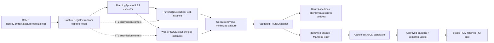

# Architecture and trust boundaries

RouteContract is a test-library adapter around Apache ShardingSphere-JDBC 5.5.3's public
`SQLExecutionHook`. It observes callback events after routing and rewriting; it does not intercept
the internal route plan.



## Event lifecycle

For the exact 5.5.3 runtime, ShardingSphere creates a fresh non-singleton hook provider for one
physical JDBC callback lifecycle. RouteContract therefore pairs `start` and `finish` in that
provider instance:

```text
start(dataSourceName, rewrittenSql, parameters, trunkThread)
  -> callback returned  => CALLBACK_RETURNED
  -> callback threw     => CALLBACK_FAILURE (diagnostic-only)
  -> no terminal event  => START_REPORTED / INCOMPLETE
```

`CALLBACK_RETURNED` means only that ShardingSphere 5.5.3 reported `finishSuccess` to that hook
provider after the wrapped physical `executeSQL` call returned. It does not prove completion of the
enclosing JDBC operation, application action, transaction commit, surrounding business success, or
membership in a complete planned route.

## Correlation

The caller receives a random capture token. ShardingSphere 5.5.3 wraps executor submissions with
Alibaba TransmittableThreadLocal executors, so RouteContract propagates only that token into worker
submissions. A custom `childValue` returns `null` to prevent the first active capture from becoming
an inherited worker-thread baseline. The mutable capture is held in a concurrent registry, while a
provider-local handle pairs its own start and finish.

The supported claim is bounded: twenty pairs of caller operations had capture scopes open
concurrently and produced zero mixed captures in the real MySQL fixture. The test does not force or
measure temporal overlap between physical hook callbacks, so it is not evidence that the callbacks
themselves ran simultaneously. Arbitrary application `@Async`, reactive, batch, and other
ShardingSphere versions are outside v0.1.

## Fail-closed boundaries

An execution contract is eligible to pass only when all of the following hold:

- the `infra-executor` and `infra-spi` compatibility artifacts each report version 5.5.3, and
  exactly one RouteContract SPI provider passes preflight;
- at least one hook start is observed;
- every retained start has a callback-returned terminal event;
- the caller is not interrupted at close;
- no collector diagnostic exists;
- no more than 10,000 attempts are retained.

Callback failures are kept as minimized diagnostic snapshots but cannot satisfy route assertions or
manifest matching. This matters because ShardingSphere 5.5.3 can return from a failed parallel
execution without waiting for every submitted worker. A fixed delay would not prove quiescence, so
v0.1 refuses certification instead.

That refusal applies to the failure, interruption and incomplete states visible in the frozen
snapshot. v0.1 does not claim to detect every hook invocation that could arrive after snapshot
freeze or registry removal. Its positive completeness claim is limited to the supported normally
returned synchronous path; it is not a universal quiescence proof for arbitrary late callbacks.

## Information boundaries

The callback receives sensitive raw objects, but the retained model stores only:

- hook-reported data-source name in memory, replaced in JSON by a caller-provided reviewed alias;
- SHA-256 of the exact rewritten SQL `String` encoded as UTF-8;
- parameter count and Java type names, never parameter values;
- trunk/worker flag in memory, excluded from canonical JSON;
- callback outcome and exception class, never exception message.

An unsalted SQL hash is guessable for low-entropy statements, and Java type names can reveal package
structure. Manifests and CI logs therefore remain internal engineering metadata; see
[SECURITY.md](../SECURITY.md).

## Approval boundary

RouteContract can write only an explicit candidate path. It never derives paths from `operationId`
and exposes no approve operation. Candidate writes reject lexical aliases, real-parent aliases,
hard links and symbolic-link leaf paths that could identify the approved file. A maintainer reviews
the canonical diff and replaces the approved baseline outside the library.

The data-source alias mapping is also trusted, version-controlled policy. Aliases must be static and
non-sensitive; reusing a raw physical name as an alias exposes that name. Remapping a new physical
name to an existing alias can hide target drift, so the mapping must be reviewed with the manifest.
