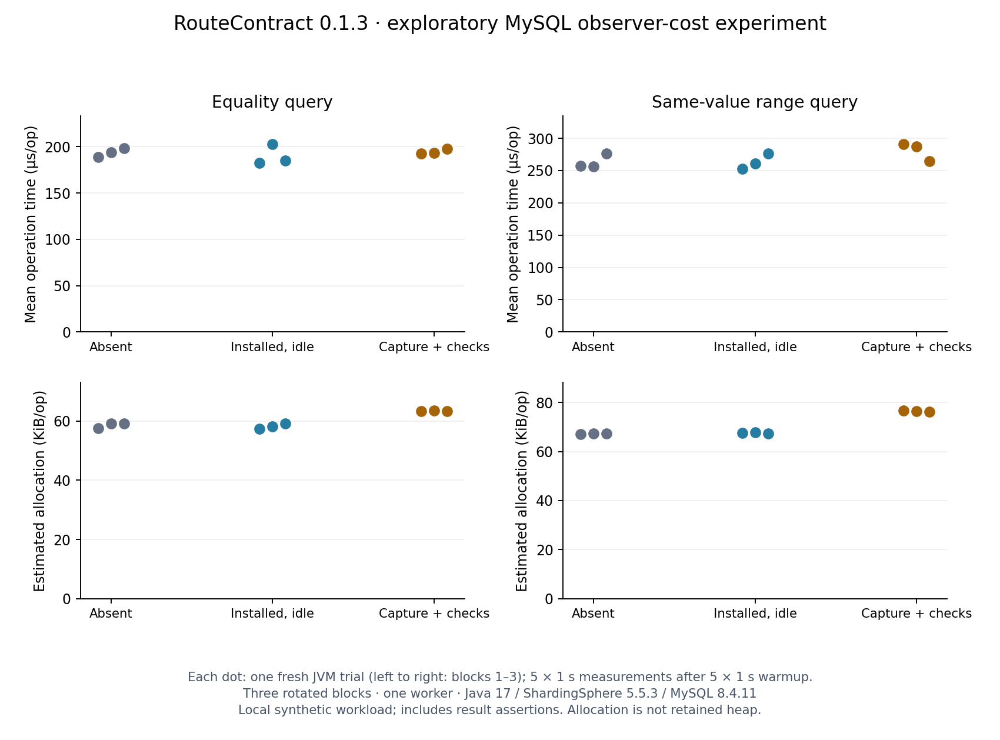

# What does capture add to a test?

In this local experiment, capture plus execution assertions allocated more memory per operation
than leaving the installed library idle in all three blocks. **The timing differences changed
direction between blocks. This run does not establish a stable latency-overhead percentage.**

Evidence label: **verified - MySQL**, **verified - ShardingSphere-JDBC 5.5.3**. These labels cover
the completed synthetic fixture and experiment, not production performance or independent use.

## Results

Each value below is the median of three fresh-JVM trial means; parentheses show the minimum
and maximum of those means. These are not request percentiles or confidence intervals.
One trial has five one-second measurement iterations after five one-second warmup iterations.

| Query | Condition | Time, µs/op | Estimated allocation, KiB/op |
| --- | --- | --- | --- |
| Equality | Library absent | 194.13 (189.18–198.43) | 59.11 (57.66–59.26) |
| Equality | Installed, capture idle | 185.27 (182.80–203.05) | 58.10 (57.46–59.18) |
| Equality | Capture + execution checks | 193.39 (193.00–197.61) | 63.37 (63.33–63.52) |
| Same-value range | Library absent | 256.93 (256.27–276.55) | 67.30 (67.18–67.38) |
| Same-value range | Installed, capture idle | 261.02 (252.52–276.44) | 67.54 (67.40–67.81) |
| Same-value range | Capture + execution checks | 287.11 (264.25–291.17) | 76.54 (76.25–76.64) |



Within the same block, checked versus idle allocation increased by **4.19–5.86 KiB/op** for
equality and **8.72–9.10 KiB/op** for the range query. These are differences in JMH's allocation
estimate, not object-retention or leak measurements.

The corresponding time ratios were **1.056, 0.952, 1.067** for equality and **1.153, 1.100,
0.956** for range. A ratio below one in a block does not show that instrumentation makes the
query faster. With only three fresh JVMs per condition/query and local Docker scheduling,
the direction changes prevent a general speed or overhead claim. Likewise, the overlapping
absent/idle observations do not prove that installing the hook has zero cost.

## What was measured

The [runner](../examples/observer-cost/run.py) compiled a separate JMH 1.37 project against public
RouteContract **0.1.3** from Maven Central. It reused the [first-project fixture and repository](../examples/first-project/src/test/java/io/github/ym0506/routecontract/examples/firstproject/OrderFixture.java).
There were **18 fresh JVM trials**: three blocks × three conditions × two queries, with one
benchmark worker. Condition order rotated across blocks: absent/idle/checked,
idle/checked/absent, checked/absent/idle. The full run completed on 2026-09-09.

Every timed operation acquired and closed a connection, prepared and executed a query,
materialized the result and checked the expected business row. The checked condition also
called `captureResult` and asserted complete capture, no reported execution failures and the
fixture's expected physical JDBC execution attempts: one for equality, two for range.
Any failed assertion aborts the experiment. This measures the additional **capture-and-check
workflow**, not the hook in isolation. Manifest/report generation and baseline approval are
outside the experiment.

Each JVM created two disposable MySQL instances and initialized the shared data source before
warmup. The absent classpath removed only the public RouteContract JAR; all other 135 dependency
files remained the same. Setup checked class-resource and SPI-provider presence in every fork.
A negative control deliberately included the JAR in the absent condition and was rejected
before fixture execution. The plotter also rejected smoke-only output.

| Environment | Recorded value |
| --- | --- |
| Machine | Apple M2 Pro, 12 logical CPUs, 16 GiB RAM |
| OS | Darwin 25.4.0, arm64 |
| JVM | Homebrew OpenJDK 17.0.15+0, 512 MiB initial/max heap |
| Database | Two disposable MySQL 8.4.11 containers; Docker server 29.2.1 |
| ShardingSphere | Exact JDBC 5.5.3; fixture executor size 4, one benchmark caller |
| MySQL image | `mysql:8.4.11@sha256:b3b90af2a6552ae30c266fdb7d5dd55f3afb72404bb78d37fe8a23eb857fd3fb` |
| Release JAR SHA-256 | `9e883e618eb09d9ecf30814151bb4b0a43eba02c78d288cc582fa7e57e6edba2` |
| Measured harness revision | `da8dd4ed955791a4805911888f9132764b6ed1d0` |

The run receipt hashes the measured source inputs and all 136 runtime dependency files. Raw
JMH output includes iteration measurements, GC-profiler estimates and its own statistical
output. The dot plot uses trial means so five iterations in one JVM are not presented as five
independent environment replications.

## Reproduce or inspect

```sh
# Select a Java 17 JAVA_HOME first when needed; use a new output directory.
python3 examples/observer-cost/run.py --output /absolute/new/observer-cost-run

# Optional plot; the retained figure was rendered with matplotlib 3.10.7.
python3 examples/observer-cost/plot.py /absolute/new/observer-cost-run \
  --output /absolute/new/observer-cost-run/observer-cost.png
```

- [Complete run receipt and source/dependency hashes](evidence/observer-cost-0.1.3-2026-09-09/run.json)
- [All trial means and within-block comparisons](evidence/observer-cost-0.1.3-2026-09-09/summary.json)
- [Raw JSON/log directory and checksums](evidence/observer-cost-0.1.3-2026-09-09/)
- [Negative controls](evidence/observer-cost-0.1.3-2026-09-09/negative-controls.json)
- [Experiment scope and JMH method references](../examples/observer-cost/README.md)

The separate CI workflow runs `--smoke` to check the fixture, classpaths and assertions. Its
short run is never a performance result and must not be combined with this local measurement.

## Design implications and limits

The released [capture registry](https://github.com/ym0506/routecontract/blob/v0.1.3/routecontract-shardingsphere-5.5/src/main/java/io/github/ym0506/routecontract/internal/CaptureRegistry.java)
creates per-operation state, collects per-attempt fingerprints/type information and freezes a
snapshot. The [version/SPI preflight](https://github.com/ym0506/routecontract/blob/v0.1.3/routecontract-shardingsphere-5.5/src/main/java/io/github/ym0506/routecontract/internal/ShardingSphere553Preflight.java)
caches successful verification. These are source-level explanations of the work performed;
the experiment does not attribute a specific byte/time cost to any one method. Allocation
profiling would be the next step before selecting an optimization.

This is one maintainer-run synthetic workload, with few rows, one caller and a warm query path.
It does not measure retained heap, CPU consumption, p95/p99 service latency, high concurrency,
long-running stability or other JDK/ShardingSphere versions. The fixed warmup is not proof of
JIT convergence. Capture checks and JMH GC profiling both contribute to the measured setup.
No baseline was approved, no production database was contacted, and no claim of an external
user or operational performance improvement follows from this result.

A later [capture-lifecycle diagnostic](capture-retention.md) inspects live per-capture
objects after repeated operations and deliberate exceptions. It is separate from this
allocation/timing experiment and does not establish long-duration or native-memory stability.
